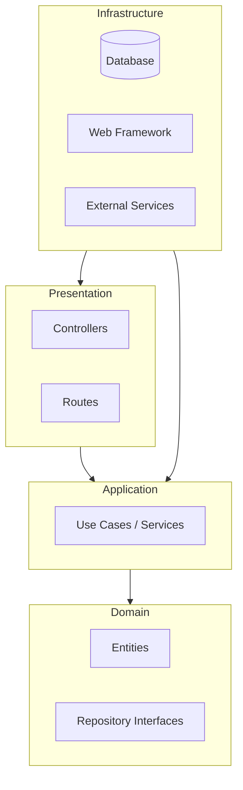

# Project Architecture

This project follows the **Clean Architecture** principles (also known as Hexagonal Architecture or Onion Architecture). The main goal is to separate the business logic from technical details (Frameworks, Database, UI).

## 🏗 Overview

The code is organized in concentric circles. The golden rule is the **Dependency Rule**: source code can only depend on code located in a more inner circle.

## 📂 Folder Structure (`src/`)

### 1. `domain/` (The Core)

This is the innermost layer. It depends on **nothing**. It contains pure business logic.

- **`entities/`**: Fundamental business objects (e.g., `User`, `Product`). They contain data and strict validation rules.
- **`repositories/`**: The _interfaces_ that define how data is accessed (e.g., `IUserRepository`). Note carefully: these are just interfaces, not the SQL implementation!
- **`valueObjects/`**: Immutable objects defined by their attributes rather than an identity (e.g., `Email`, `Password`).

### 2. `application/` (The Orchestration)

This layer contains the application's use cases. It orchestrates entities and domain interfaces to perform an action.

- **`services/`** or **`use-cases/`**: Contains application logic (e.g., `CreateUser`, `GetProduct`).
- **`dtos/`** (Data Transfer Objects): Simple objects used to pass data between layers without exposing entities directly.

### 3. `infrastructure/` (Technical Details)

This is where concrete implementations are found. This layer "knows" how to talk to the database, send emails, etc.

- **`persistence/`**: Implementation of Repositories (e.g., `MongoUserRepository`, `PostgresProductRepository`). This is where TypeORM, Mongoose, etc., are used.
- **`logging/`**: Logging configuration.
- **`config/`**: Application configuration (environment variables).

### 4. `presentation/` (The Interface)

This is the layer that interacts with the outside world (here, via HTTP/REST).

- **`controllers/`**: Receives HTTP requests, calls Application layer services, and returns an HTTP response.
- **`routes/`**: Defines API URLs.
- **`middlewares/`**: Error handling, authentication, request validation.

## 🔄 Control Flow vs Dependency Flow

Although the control flow goes from the outside in (HTTP Request -> Controller -> Service -> Repository), dependencies point inwards thanks to Inversion of Control (interfaces are in the Domain, implementations in Infrastructure).
