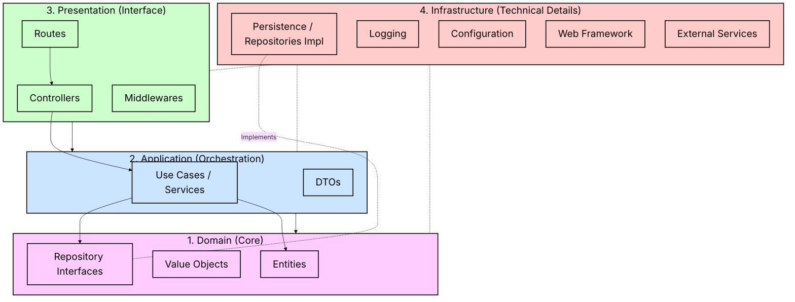

# Detailed Architecture Diagram

```mermaid
%%{init: {'theme': 'base', 'themeVariables': {'fontFamily': 'Inter', 'fontSize': 24}}}%%
graph TD
    subgraph Infrastructure ["4. Infrastructure (Technical Details)"]
        direction TB
        Persistence[Persistence / Repositories Impl]
        Logging[Logging]
        Config[Configuration]
        WebFramework[Web Framework]
        ExternalServices[External Services]
    end
    subgraph Presentation ["3. Presentation (Interface)"]
        direction TB
        Controllers[Controllers]
        Routes[Routes]
        Middlewares[Middlewares]
    end
    subgraph Application ["2. Application (Orchestration)"]
        direction TB
        UseCases[Use Cases / Services]
        DTOs[DTOs]
    end
    subgraph Domain ["1. Domain (Core)"]
        direction TB
        Entities[Entities]
        ValueObjects[Value Objects]
        RepoInterfaces[Repository Interfaces]
    end
    %% Flux de Dépendance (Vers l'intérieur)
    Infrastructure -.- Presentation
    Infrastructure -.- Application
    Infrastructure -.- Domain
    Presentation --> Application
    Application --> Domain
    %% Détails des interactions
    Routes --> Controllers
    Controllers --> UseCases
    UseCases --> RepoInterfaces
    UseCases --> Entities
    Persistence -.-|Implements| RepoInterfaces
    %% Styles
    classDef domain fill:#ffccff,stroke:#000,stroke-width:2px,font-family:Inter,color:black,font-size:24px;
    classDef application fill:#cce5ff,stroke:#000,stroke-width:2px,font-family:Inter,color:#000,font-size:24px;
    classDef presentation fill:#ccffcc,stroke:#000,stroke-width:2px,font-family:Inter,color:#000,font-size:24px;
    classDef infrastructure fill:#ffcccc,stroke:#000,stroke-width:2px,font-family:Inter,color:#000,font-size:24px;

    class Domain,Entities,ValueObjects,RepoInterfaces domain;
    class Application,UseCases,DTOs application;
    class Presentation,Controllers,Routes,Middlewares presentation;
    class Infrastructure,Persistence,Logging,Config,WebFramework,ExternalServices infrastructure;
```
