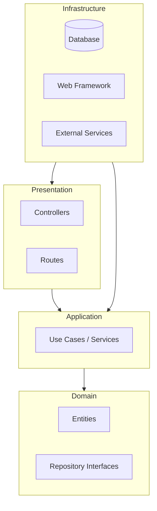

# Architecture du Projet

Ce projet suit les principes de la **Clean Architecture** (aussi appelée Architecture Hexagonale ou Onion Architecture). L'objectif principal est de séparer le code métier (Business Logic) des détails techniques (Frameworks, Base de données, UI).

## 🏗 Vue d'ensemble

Le code est organisé en cercles concentriques. La règle d'or est la **Règle de Dépendance** : le code source ne peut dépendre que du code situé dans un cercle plus intérieur.

## 📂 Structure des Dossiers (`src/`)

### 1. `domain/` (Le Cœur)

C'est la couche la plus interne. Elle ne dépend de **rien**. Elle contient la logique métier pure.

- **`entities/`** : Les objets métier fondamentaux (ex: `User`, `Product`). Ils contiennent les données et les règles de validation strictes.
- **`repositories/`** : Les _interfaces_ qui définissent comment on accède aux données (ex: `IUserRepository`). Notez bien : ce ne sont que des interfaces, pas l'implémentation SQL !
- **`valueObjects/`** : Objets immuables définis par leurs attributs plutôt que par une identité (ex: `Email`, `Password`).

### 2. `application/` (L'Orchestration)

Cette couche contient les cas d'utilisation de l'application. Elle orchestre les entités et les interfaces du domaine pour réaliser une action.

- **`services/`** ou **`use-cases/`** : Contient la logique applicative (ex: `CreateUser`, `GetProduct`).
- **`dtos/`** (Data Transfer Objects) : Objets simples utilisés pour passer des données entre les couches sans exposer les entités directement.

### 3. `infrastructure/` (Les Détails Techniques)

C'est ici que se trouvent les implémentations concrètes. Cette couche "sait" comment parler à la base de données, envoyer des mails, etc.

- **`persistence/`** : Implémentation des Repositories (ex: `MongoUserRepository`, `PostgresProductRepository`). C'est ici qu'on utilise TypeORM, Mongoose, etc.
- **`logging/`** : Configuration des logs.
- **`config/`** : Configuration de l'application (variables d'environnement).

### 4. `presentation/` (L'Interface)

C'est la couche qui interagit avec le monde extérieur (ici, via HTTP/REST).

- **`controllers/`** : Reçoit les requêtes HTTP, appelle les services de la couche Application, et renvoie une réponse HTTP.
- **`routes/`** : Définit les URLs de l'API.
- **`middlewares/`** : Gestion des erreurs, authentification, validation des requêtes.

## 🔄 Flux de Contrôle vs Flux de Dépendance

Bien que le flux de contrôle aille de l'extérieur vers l'intérieur (Requête HTTP -> Controller -> Service -> Repository), les dépendances pointent vers l'intérieur grâce à l'inversion de contrôle (les interfaces sont dans le Domaine, les implémentations dans l'Infrastructure).
